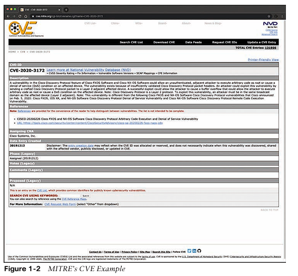
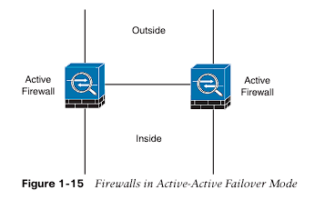

# Fundamentos de Ciber Seguridad

## Este capítulo cubre los siguientes temas:
- Introducción a la ciberseguridad
- Amenazas, vulnerabilidades y exploits
- Sistemas de seguridad de red
- Sistemas de detección de intrusiones y sistemas de prevención de intrusiones
- Protección avanzada contra malware
- Dispositivo de seguridad web
- Dispositivo de seguridad de correo electrónico
- Dispositivo de administración de seguridad de Cisco
- Cisco Identity Services Engine
- Soluciones de seguridad basadas en la nube
- Cisco NetFlow
- Prevención de pérdida de datos
- Los principios de la estrategia de defensa en profundidad
- Confidencialidad, integridad y disponibilidad: la tríada CIA
- Riesgo y análisis de riesgos
- Información de identificación personal e información de salud protegida
- Principio de privilegio mínimo y separación de funciones
- Centros de operaciones de seguridad
- Manuales, manuales de procedimientos y automatización de manuales de procedimientos
- Informática forense digital

¡Bienvenido al comienzo de su viaje hacia la certificación CyberOps Associate! Los programas de ciberseguridad reconocen que las organizaciones deben estar alertas, ser resilientes y estar listas para proteger y defender cada conexión de entrada y salida, así como los datos de la organización donde sea que se almacenen, transmitan o procesen. En este capítulo, aprenderá los conceptos de ciberseguridad y seguridad de la información. Luego, aprenderá la diferencia entre amenazas, vulnerabilidades y ataques de ciberseguridad. También explorará las amenazas de ciberseguridad más comunes, así como las vulnerabilidades comunes de software y hardware. Aprenderá los detalles sobre la tríada de confidencialidad, integridad y disponibilidad (CIA). Además, aprenderá sobre las diferentes amenazas de seguridad en la nube y de IoT.

En este capítulo, también se describen los diferentes tipos de dispositivos de seguridad de red y servicios en la nube en la industria. Compara los firewalls tradicionales y los firewalls de próxima generación (NGFW), así como los sistemas de prevención de intrusiones (IPS) tradicionales y los IPS de próxima generación (NGIPS).

Obtendrá detalles sobre las soluciones Cisco Web Security y Cisco Email Security, así como
qué es la protección avanzada contra malware (AMP), qué son los sistemas de administración de identidad, cómo usar Cisco NetFlow y detalles sobre la prevención de pérdida de datos (DLP).
El capítulo concluye con una introducción a la respuesta a incidentes y análisis forense digital (DFIR) y a las operaciones de seguridad. En el resto del libro se ofrecen más detalles sobre cada uno de estos temas.
## Introducción a la ciberseguridad
El objetivo de la ciberseguridad es proteger a cada uno de nosotros, nuestra economía, nuestras escuelas, nuestra infraestructura crítica y cualquier otra organización del daño que puede resultar del mal uso, la vulneración o la destrucción involuntaria o intencional de la información y los sistemas de información.

El riesgo de ciberseguridad incluye no solo el riesgo de una violación de datos, sino también el riesgo de que toda la organización se vea socavada por actividades comerciales que dependen de la digitalización y la accesibilidad. Como resultado, aprender a desarrollar un programa de ciberseguridad adecuado es crucial para cualquier organización. La ciberseguridad ya no puede ser algo que se delegue al equipo de tecnología de la información (TI). Todos deben participar, incluida la junta directiva.
## Ciberseguridad vs. Seguridad de la información (Infosec) 
Muchas personas confunden la seguridad de la información tradicional con la ciberseguridad. En el pasado, los programas y políticas de seguridad de la información se diseñaban para proteger la confidencialidad, la integridad y la disponibilidad de los datos dentro de los límites de una organización. Lamentablemente, esto ya no es suficiente. Las organizaciones rara vez son autónomas, y el precio de la interconectividad es un mayor nivel de exposición a ataques. Toda organización, independientemente de su tamaño o ubicación geográfica, es un objetivo potencial. La ciberseguridad es el proceso de proteger la información mediante la prevención, detección y respuesta a los ataques.

Los programas de ciberseguridad reconocen que las organizaciones deben estar alertas, ser resilientes y estar listas para proteger y defender cada conexión de entrada y salida, así como los datos de la organización donde sea que se almacenen, transmitan o procesen. Los programas y políticas de ciberseguridad amplían y se basan en los programas de seguridad de la información tradicionales, pero también incluyen lo siguiente:
- Gestión y supervisión de riesgos cibernéticos
- Inteligencia sobre amenazas e intercambio de información
- Búsqueda de amenazas (búsqueda proactiva de posibles compromisos y amenazas en su organización que no hayan sido detectados por sus productos o tecnologías de seguridad)
- Gestión de dependencias de hardware, software y organizaciones de terceros
- Respuesta a incidentes y resiliencia
## El marco de ciberseguridad del NIST
El Instituto Nacional de Estándares y Tecnología (NIST) es una agencia federal no regulatoria
reconocida dentro de la Administración de Tecnología del Departamento de Comercio de los EE. UU. La misión del NIST es desarrollar y promover la medición, los estándares y la tecnología para mejorar la productividad, facilitar el comercio y mejorar la calidad de vida. La División de Seguridad Informática (CSD) es una de las siete divisiones dentro del Laboratorio de Tecnología de la información del NIST. El marco de seguridad cibernética del NIST es una recopilación de estándares de la industria y mejores prácticas para ayudar a las organizaciones a gestionar los riesgos de seguridad cibernética. Este marco se creó en colaboración entre el gobierno de los Estados Unidos, corporaciones e individuos. Se puede acceder al marco de seguridad cibernética del NIST en www.nist.gov/

El marco de seguridad cibernética del NIST se desarrolló con una taxonomía común y uno de los objetivos principales es abordar y gestionar el riesgo de seguridad cibernética de una manera rentable para proteger la infraestructura crítica. Aunque está diseñado para un grupo específico, los requisitos pueden servir como modelo de seguridad para cualquier organización.

Guía y documentos adicionales del NIST Actualmente, hay más de 500 documentos relacionados con la seguridad de la información del NIST. Esta cantidad incluye FIPS, la serie SP 800 y 1800, boletines ITL e informes interinstitucionales del NIST:
- Estándares federales de procesamiento de información (FIPS): esta es la serie de publicaciones oficiales para estándares y pautas.
- Serie de publicaciones especiales (SP) 800: esta serie informa sobre las investigaciones, las pautas y los esfuerzos de divulgación del ITL en materia de seguridad de los sistemas de información y sus actividades de colaboración con la industria, el gobierno y las organizaciones académicas. Los documentos de la serie SP 800 se pueden descargar de https://csrc.nist.gov/publications/sp800.
- Serie de publicaciones especiales (SP) 1800: esta serie se centra en las prácticas y pautas de seguridad cibernética. El documento de la serie SP 1800 se puede descargar de https://csrc.nist.gov/publications/sp1800.
- Informes internos o interinstitucionales del NIST (NISTIR): estos informes se centran en los hallazgos de las investigaciones, incluida la información de referencia para los FIPS y los SP.
- Boletines del Laboratorio de Tecnología de la Información (ITL): cada boletín presenta un análisis en profundidad de un solo tema de interés significativo para la comunidad de sistemas de información. Los boletines se emiten según sea necesario.

Desde los controles de acceso hasta la seguridad inalámbrica, las publicaciones del NIST son un verdadero tesoro de orientación valiosa y práctica.
## Organización Internacional de Normalización
La Organización Internacional de Normalización (conocida como ISO) es una red de institutos de normalización nacionales de más de 160 países. La ISO ha desarrollado más de 13.000 normas internacionales sobre una variedad de temas, que van desde códigos de países hasta
seguridad de los pasajeros.

La serie ISO/IEC 27000 (también conocida como la Familia de Normas ISMS, o ISO27k para abreviar) comprende normas de seguridad de la información publicadas conjuntamente por la ISO y la Comisión Electrotécnica Internacional (IEC).

Los primeros seis documentos de la serie ISO/IEC 27000 brindan recomendaciones para “establecer, implementar, operar, monitorear, revisar, mantener y mejorar un Sistema de Gestión de Seguridad de la Información”:
- ISO 27001 es la especificación para un sistema de gestión de seguridad de la información (SGSI).
- ISO 27002 describe el código de prácticas para la gestión de la seguridad de la información.
- La norma ISO 27003 proporciona una guía de implementación detallada.
- La norma ISO 27004 describe cómo una organización puede supervisar y medir la seguridad utilizando métricas.
- La norma ISO 27005 define el enfoque de gestión de riesgos de alto nivel recomendado por la ISO.
- La norma ISO 27006 describe los requisitos para las organizaciones que medirán el cumplimiento de la norma ISO 27000 para la certificación.

En total, hay más de 20 documentos en la serie y varios más aún están en desarrollo.
El marco es aplicable a organizaciones públicas y privadas de todos los tamaños. Según el sitio web de la ISO, “la norma ISO ofrece recomendaciones para la gestión de la seguridad de la información para su uso por parte de quienes son responsables de iniciar, implementar o mantener la seguridad en su organización. Su objetivo es proporcionar una base común para el desarrollo de estándares de seguridad organizacional y prácticas de gestión de seguridad efectivas y brindar confianza en las relaciones entre organizaciones”.
## Amenazas, vulnerabilidades y exploits
Las siguientes secciones describen las características de las amenazas, vulnerabilidades y exploits.
### ¿Qué es una amenaza?
Una amenaza es cualquier peligro potencial para un activo. Si existe una vulnerabilidad pero aún no se ha explotado (o, lo que es más importante, aún no se conoce públicamente), la amenaza está latente y aún no se ha percibido . Si alguien está lanzando activamente un ataque contra su sistema y accede con éxito a algo o compromete su seguridad contra un activo, la amenaza se hace realidad.
La entidad que aprovecha la vulnerabilidad se conoce como actor malicioso, y la ruta utilizada por este actor para realizar el ataque se conoce como agente de amenaza o vector de amenaza.
### ¿Qué es una vulnerabilidad?
Una vulnerabilidad es una debilidad en el diseño, la implementación, el software o el código del sistema o la falta de un mecanismo. Una vulnerabilidad específica puede manifestarse como cualquier cosa, desde una debilidad en el diseño del sistema hasta la implementación de un procedimiento operativo. La correcta implementación de salvaguardas y contramedidas de seguridad podría mitigar una vulnerabilidad y reducir el riesgo de explotación.

Las vulnerabilidades y debilidades son comunes, principalmente porque no existe ningún software o código perfecto. Algunas vulnerabilidades tienen un impacto limitado y se mitigan fácilmente; sin embargo, muchas tienen implicaciones más amplias.

Las vulnerabilidades se pueden encontrar en cada uno de los siguientes elementos:
- Aplicaciones: el software y las aplicaciones vienen con toneladas de funcionalidad. Las aplicaciones pueden estar configuradas para la facilidad de uso en lugar de para la seguridad. Las aplicaciones pueden necesitar un parche o una actualización que puede o no estar disponible. Los atacantes que atacan las aplicaciones tienen un entorno rico en objetivos para examinar. Piense en todas las aplicaciones que se ejecutan en su computadora de casa o del trabajo.
- Sistemas operativos: el software del sistema operativo se carga en las estaciones de trabajo y los servidores. Los atacantes pueden buscar vulnerabilidades en sistemas operativos que no han sido parcheados o actualizados.
- Hardware: las vulnerabilidades también se pueden encontrar en el hardware. La mitigación de una vulnerabilidad de hardware puede requerir parches para el microcódigo (firmware), así como para el sistema operativo u otro software del sistema. Algunos buenos ejemplos de vulnerabilidades basadas en hardware conocidas son Spectre y Meltdown. Estas vulnerabilidades se aprovechan de una característica llamada ejecución especulativa, común en la mayoría de las arquitecturas de procesadores modernas.
- Configuración incorrecta: el archivo de configuración y la configuración del dispositivo o software pueden estar mal configurados o implementados en un estado no seguro. Esto puede ser puertos abiertos, servicios vulnerables o dispositivos de red mal configurados. Solo piense en las redes inalámbricas. ¿Puede detectar algún dispositivo inalámbrico en su vecindario que tenga el cifrado desactivado?
- Software Shrinkwrap: esta es la aplicación o archivo ejecutable que se ejecuta en una estación de trabajo o servidor. Cuando se instala en un dispositivo, puede tener toneladas de funcionalidad o scripts o códigos de muestra disponibles.

Los proveedores, investigadores de seguridad y centros de coordinación de vulnerabilidades generalmente asignan a las vulnerabilidades un identificador que se divulga al público. Esto se conoce como el identificador de vulnerabilidades y exposiciones comunes (CVE). CVE es un estándar de toda la industria. CVE está patrocinada por US-CERT, la oficina de Ciberseguridad y Comunicaciones del Departamento de Seguridad Nacional de los Estados Unidos. MITRE, que opera como Centro de Investigación y Desarrollo Financiado por el Gobierno Federal (FFRDC) del DHS, ha registrado los derechos de autor de la lista CVE para el beneficio de la comunidad a fin de garantizar que siga siendo un estándar libre y abierto, así como para proteger legalmente el uso continuo de la misma y cualquier contenido resultante por parte del gobierno, los proveedores y/o los usuarios.

La Figura 1-1 muestra un ejemplo de un aviso de seguridad de Cisco que revela una vulnerabilidad en los productos de Cisco. Este aviso incluye un identificador de CVE e información detallada sobre la gravedad de la vulnerabilidad, la descripción, la configuración afectada, las correcciones y otro contenido relacionado con la vulnerabilidad.


MITRE mantiene la lista CVE y su sitio web público, administra el Programa de compatibilidad CVE, supervisa las autoridades de numeración CVE (CNA) y brinda orientación técnica imparcial al Consejo editorial de CVE durante todo el proceso para garantizar que CVE sirva al interés público.
El objetivo de CVE es facilitar el intercambio de datos entre herramientas, repositorios de vulnerabilidades y servicios de seguridad. La Figura 1-2 muestra la entrada CVE en el sitio web CVE de MITRE para la vulnerabilidad abordada en el aviso de seguridad que se muestra en la Figura 1-1.

La Base de Datos Nacional de Vulnerabilidades (NVD) también mantiene una lista detallada de las vulnerabilidades reveladas en la industria. Se puede acceder a la NVD en https://nvd.nist.gov/, y ​​en la Figura 1-3 se muestra un ejemplo del mismo informe de vulnerabilidades en NVD.



### ¿Qué es un exploit?
Un exploit se refiere a un software, una herramienta, una técnica o un proceso que se aprovecha de una vulnerabilidad que conduce al acceso, la escalada de privilegios, la pérdida de integridad o la denegación de servicio en un sistema informático. Los exploits son peligrosos porque todo el software tiene vulnerabilidades; los piratas informáticos y los perpetradores saben que existen vulnerabilidades y buscan aprovecharse de ellas. Aunque la mayoría de las organizaciones intentan encontrar y reparar vulnerabilidades, algunas organizaciones carecen de fondos, procesos, políticas y prácticas de diseño suficientes para proteger sus redes. A veces, nadie puede saber que existe la vulnerabilidad y se explota.

Eso se conoce como exploit de día cero. Incluso cuando sabe que hay un problema, tiene la carga del hecho de que existe una ventana entre el momento en que se divulga una vulnerabilidad y el momento en que hay un parche disponible para evitar el exploit. Cuanto más crítico es el servidor, más lento suele ser el parche. La administración puede tener miedo de interrumpir el servidor o de que el parche pueda afectar la estabilidad o el rendimiento. Por último, el tiempo necesario para implementar e instalar el parche de software en servidores y estaciones de trabajo de producción expone la infraestructura de TI de una organización a un período adicional de riesgo.


Existen varios lugares donde las personas intercambian exploits con intenciones maliciosas. El más frecuente es la dark web. La dark web (o red oscura) es una superposición de redes y sistemas que utiliza Internet, pero requiere software y configuraciones específicas para acceder a ella. La dark web es solo una pequeña parte de la deep web. La deep web es una colección de información y sistemas en Internet que no está indexada por los motores de búsqueda web. A menudo, las personas confunden incorrectamente el término deep web con dark web.

No todos los exploits se comparten con intenciones maliciosas. Por ejemplo, muchos investigadores de seguridad comparten exploits de prueba de concepto (POC) en sitios públicos como The Exploit Database (o Exploit-DB) y GitHub. The Exploit Database es un sitio mantenido por Offensive Security donde los investigadores de seguridad y otras personas publican exploits para vulnerabilidades conocidas. Se puede acceder a la Exploit Database en www.exploit-db.com. La Figura 1-4 muestra un ejemplo de un exploit disponible públicamente en Exploit Database.


### Riesgo, activos, amenazas y vulnerabilidades
Como sucede con cualquier tema de nueva tecnología, para comprender mejor el campo de la seguridad, debe aprender la terminología que se utiliza. Para ser un profesional de la seguridad, debe comprender la relación entre riesgo, amenazas, activos y vulnerabilidades.

El riesgo es la probabilidad o posibilidad de que ocurra o se materialice una amenaza. Hay tres elementos básicos del riesgo: activos, amenazas y vulnerabilidades. Para abordar el riesgo, el gobierno federal de los EE. UU. ha adoptado un Marco de gestión de riesgos (RMF). El proceso RMF se basa en los conceptos clave de seguridad de sistemas de información empresarial, rentable y basada en la misión y el riesgo. La Publicación especial 800-37 del NIST, “Guía para aplicar el Marco de gestión de riesgos a los sistemas de información federales”, transforma el proceso tradicional de Certificación y acreditación (C&A) en el RMF de seis pasos. Veamos los diversos componentes asociados con el riesgo, que incluyen activos, amenazas y vulnerabilidades.

Un activo es cualquier elemento de valor económico que posee una persona o una empresa. Los activos pueden ser reales (como enrutadores, servidores, discos duros y computadoras portátiles) o virtuales (como fórmulas, bases de datos, hojas de cálculo, secretos comerciales y tiempo de procesamiento). Independientemente del tipo de activo del que se trate, si este se pierde, se daña o se ve comprometido, puede suponer un coste económico para la organización.

Una amenaza establece el escenario para el riesgo y es cualquier agente, condición o circunstancia que podría causar daño, pérdida o comprometer un activo de TI o un activo de datos. Desde la perspectiva de un profesional de seguridad, las amenazas se pueden categorizar como eventos que pueden afectar la confidencialidad, integridad o disponibilidad de los activos de la organización. Estas amenazas pueden resultar en destrucción, divulgación, modificación, corrupción de datos o denegación de servicio. Algunos ejemplos de los tipos de amenazas que una organización puede enfrentar incluyen los siguientes:
- Desastres naturales, clima y daños catastróficos: huracanes, tormentas, cortes de energía, incendios, inundaciones, terremotos y otros eventos naturales componen una amenaza constante.
- Ataques de piratas informáticos: un interno o externo que no está autorizado y ataca deliberadamente la infraestructura, los componentes, los sistemas o los datos de una organización.
- Ciberataque: Atacantes que tienen como objetivo infraestructuras nacionales críticas, como plantas de agua, plantas eléctricas, plantas de gas, refinerías de petróleo, refinerías de gasolina, plantas de energía nuclear, plantas de gestión de residuos, etc. Stuxnet es un ejemplo de una de esas herramientas diseñadas precisamente para ese propósito.
- Virus y malware: Una categoría completa de herramientas de software que son maliciosas y están diseñadas para dañar o destruir un sistema o datos.
- Divulgación de información confidencial: Cada vez que se produce una divulgación de información confidencial, puede ser una amenaza crítica para una organización si dicha divulgación causa pérdida de ingresos, genera posibles responsabilidades o proporciona una ventaja competitiva a un adversario. Por ejemplo, si su organización sufre una infracción y se expone información detallada de los clientes (por ejemplo, información de identificación personal [PII]), dicha infracción podría tener posibles responsabilidades y pérdida de confianza de sus clientes. Otro ejemplo es cuando un actor de amenazas roba el código fuente o los documentos de diseño y los vende a sus competidores.
- Ataques de denegación de servicio (DoS) o de denegación de servicio distribuida (DDoS): un ataque contra la disponibilidad que está diseñado para poner de rodillas a la red, o al acceso a un host/servidor TCP/IP en particular, inundándolo con tráfico inútil. Hoy en día, la mayoría de los ataques DoS se lanzan a través de botnets, mientras que en el pasado se podían haber utilizado herramientas como Ping of Death y Teardrop. Al igual que con el malware, los piratas informáticos desarrollan constantemente nuevas herramientas DoS para que Storm y Mariposa, por ejemplo, sean reemplazadas por otras amenazas más actuales.
### Actores de amenazas
Los actores de amenazas son las personas (o un grupo de personas) que realizan un ataque o son responsables de un incidente de seguridad que afecta o tiene el potencial de afectar a una organización o individuo. Existen varios tipos de actores de amenazas:
- Script kiddies: estas personas utilizan "scripts" o herramientas existentes para hackear computadoras y redes. Carecen de la experiencia para escribir sus propios scripts.
- Grupos de crimen organizado: el objetivo principal de estos grupos es robar información, estafar a personas y ganar dinero.
- Patrocinadores estatales y gobiernos: estos agentes están interesados ​​en robar datos, incluidos datos de propiedad intelectual e investigación y desarrollo de los principales fabricantes, agencias gubernamentales y contratistas de defensa.
- Hacktivistas: estas personas llevan a cabo ataques de ciberseguridad destinados a promover una causa social o política.
- Grupos terroristas: estos grupos están motivados por creencias políticas o religiosas.
- 
Originalmente, el término hacker se usaba para un entusiasta de la informática. Un hacker era una persona que disfrutaba entendiendo el funcionamiento interno de un sistema, computadora y red informática y que continuaba hackeando hasta que entendía todo acerca del sistema. Con el tiempo, la prensa popular comenzó a describir a los hackers como individuos que irrumpían en las computadoras con intenciones maliciosas. La industria respondió desarrollando la palabra cracker, que es la abreviatura de hacker criminal. El término cracker fue desarrollado para describir a individuos que buscan comprometer la seguridad de un sistema sin el permiso de una parte autorizada.

Con toda esta confusión sobre cómo distinguir a los buenos de los malos, se acuñó el término hacker ético. Un hacker ético es un individuo que realiza pruebas de seguridad y otras actividades de evaluación de vulnerabilidad para ayudar a las organizaciones a proteger sus infraestructuras. A veces, a los hackers éticos se los conoce como hackers de sombrero blanco.

Los motivos e intenciones de los hackers varían. Algunos hackers son estrictamente legítimos, mientras que otros violan la ley de manera rutinaria. La Figura 1-5 muestra algunas de las categorías más comunes utilizadas en la industria para identificar a los hackers y sus motivos.
### Inteligencia sobre amenazas
La inteligencia sobre amenazas se refiere al conocimiento sobre una amenaza existente o emergente a los activos, incluidas las redes y los sistemas. La inteligencia sobre amenazas incluye contexto, mecanismos, indicadores de compromiso (IoC), implicaciones y consejos prácticos. La inteligencia sobre amenazas incluye detalles sobre las tácticas, técnicas y procedimientos de estos adversarios. El objetivo principal de la inteligencia sobre amenazas es informar las decisiones comerciales con respecto a los riesgos y las implicaciones asociadas con las amenazas.


La conversión de estas definiciones en un lenguaje común podría traducirse en que la inteligencia de amenazas sea un conocimiento basado en evidencia de las capacidades de los actores de amenazas internos y externos.

Este tipo de datos puede ser beneficioso para el centro de operaciones de seguridad (SOC) de cualquier organización. La inteligencia de amenazas extiende la conciencia de la ciberseguridad más allá de la red interna al consumir inteligencia de otras fuentes de Internet relacionadas con posibles amenazas para usted o su organización. Por ejemplo, puede obtener información sobre amenazas que han afectado a diferentes organizaciones externas. Posteriormente, puede prepararse de manera proactiva en lugar de reaccionar una vez que se detecta la amenaza contra su red. Proporcionar una fuente de datos de enriquecimiento es un servicio que las plataformas de inteligencia de amenazas normalmente brindarían.

La Figura 1-6 muestra un proceso de inteligencia de amenazas de cinco pasos para evaluar las fuentes y la información de inteligencia de amenazas.


En la actualidad, existen en el mercado muchas plataformas y servicios de inteligencia sobre amenazas diferentes. La inteligencia sobre amenazas cibernéticas se centra en brindar información útil sobre los adversarios, incluidos los indicadores de riesgo. Los feeds de inteligencia sobre amenazas lo ayudan a priorizar las señales de los sistemas internos contra amenazas desconocidas. La inteligencia sobre amenazas cibernéticas le permite concentrarse más en la investigación de ciberseguridad porque, en lugar de buscar ciegamente eventos “nuevos” y “anormales”, puede buscar indicadores de riesgo, direcciones IP, URL o patrones de explotación específicos.

Se están desarrollando varios estándares para difundir información de inteligencia sobre amenazas.
A continuación, se ofrecen algunos ejemplos:
- **Structured Threat Information eXpression (STIX)**: este lenguaje exprés está diseñado para compartir información sobre ciberataques. Los detalles de STIX pueden contener datos como direcciones IP o nombres de dominio de servidores de comando y control (a menudo denominados C2 o CnC), hashes de malware, etc. STIX fue desarrollado originalmente por MITRE y ahora lo mantiene OASIS. Puede obtener más información en http://stixproject.github.io.
- **Trusted Automated eXchange of Indicator Information (TAXII)**: este mecanismo de transporte abierto estandariza el intercambio automatizado de información sobre amenazas cibernéticas. TAXII fue desarrollado originalmente por MITRE y ahora lo mantiene OASIS. Puede obtener más información en http://taxiiproject.github.io.
- **Cyber ​​Observable eXpression (CybOX)**: este esquema estandarizado gratuito se utiliza para la especificación, captura, caracterización y comunicación de eventos de propiedades con estado que son observables en el dominio operativo. CybOX fue desarrollado originalmente por MITRE y ahora lo mantiene OASIS. Puede obtener más información en https://cyboxproject.github.io.
- **Open Indicators of Compromise (OpenIOC)**: este marco abierto se utiliza para compartir inteligencia sobre amenazas en un formato digerible por máquina. Obtenga más información en www.openioc.org.
- **Open Command and Control (OpenC2)**: este lenguaje se utiliza para el comando y control de tecnologías de ciberdefensa. El foro OpenC2 era una comunidad de partes interesadas en la ciberseguridad que fue facilitada por la Agencia de Seguridad Nacional de los EE. UU. OpenC2 es ahora un comité técnico (TC) y una especificación de OASIS. Puede obtener más información en www.oasis-open.org/committees/tc_home.php?wg_abbrev=openc2.

Cabe señalar que también se pueden aprovechar muchas fuentes de código abierto y no relacionadas con la seguridad para obtener información sobre amenazas. Algunos ejemplos de estas fuentes son las redes sociales, los foros, los blogs y los sitios web de los proveedores.
### Plataforma de inteligencia de amenazas
Muchas organizaciones implementan sus propias plataformas de inteligencia de amenazas (TIP) para agregar, correlacionar y analizar información de inteligencia de amenazas de múltiples fuentes casi en tiempo real. Para que los analistas del centro de operaciones de seguridad (SOC) puedan defenderse de las amenazas actuales, las TIP deben escalar y admitir la creciente cantidad de datos de inteligencia de amenazas generados por una variedad de recursos (incluidos los registros del sistema y las fuentes de inteligencia de amenazas). Las plataformas de inteligencia de amenazas modernas proporcionan y también utilizan API para recopilar o intercambiar datos.

Las plataformas de inteligencia de amenazas admiten lo siguiente:
- Recopilación de inteligencia de amenazas: recopilación y agregación de múltiples formatos de datos, incluidos CSV, STIX, XML, JSON, IODEK, OpenIOC y fuentes de inteligencia de amenazas patentadas.
- Correlación de datos: análisis y correlación automáticos de datos de inteligencia de amenazas.
- Enriquecimiento y contextualización: proporciona un contexto enriquecido en torno a las amenazas para permitir que los analistas del SOC y los encargados de responder a incidentes tengan la mayor cantidad posible de datos sobre el ataque y el actor de la amenaza (adversario).
- Analizar: automatiza el análisis de indicadores de amenazas para permitir la identificación de las tácticas, técnicas y procedimientos (TTP) del adversario. A menudo, los TIP pueden aprovechar las tácticas y técnicas del adversario incluidas en el marco ATT&CK de MITRE (attack.mitre.org).
- Integraciones con otros sistemas de seguridad: los TIP modernos brindan la capacidad de integrarse con muchas soluciones de seguridad diferentes (incluidas las soluciones Security Information and Event Management [SIEM] y Security Orchestration Automation and Response [SOAR]).
- Actuar: la plataforma de inteligencia de amenazas debe permitir a los profesionales de seguridad crear herramientas y aplicaciones que puedan ayudar a responder y mitigar las amenazas y los ataques de ciberseguridad.

## Vulnerabilidades, Exploits y Exploit Kits

Anteriormente en este capítulo, aprendió que una vulnerabilidad es una debilidad en el diseño, la implementación, el software o el código del sistema, o la falta de un mecanismo. La cantidad de vulnerabilidades reveladas continúa aumentando. Puede mantenerse al día con las revelaciones de vulnerabilidades suscribiéndose a los canales de vulnerabilidades y buscando repositorios públicos como la Base de datos nacional de vulnerabilidades (NVD). Puede acceder a la NVD en https://nvd.nist.gov.

Existen muchas vulnerabilidades de software y hardware diferentes y categorías relacionadas.
Los siguientes son ejemplos de vulnerabilidades basadas en inyección:
- Vulnerabilidades de inyección SQL
- Vulnerabilidades de inyección HTML
- Vulnerabilidades de inyección de comandos
Las vulnerabilidades de inyección de código se explotan al obligar a una aplicación o un sistema a procesar datos no válidos. Un atacante aprovecha este tipo de vulnerabilidad para inyectar código en un sistema vulnerable y cambiar el curso de la ejecución. Una explotación exitosa puede llevar a la divulgación de información confidencial, manipulación de datos, condiciones de denegación de servicio y más. Algunos ejemplos de vulnerabilidades de inyección de código incluyen los siguientes:
- Inyección SQL
- Inyección de script HTML
- Evaluación de código dinámico
- Inyección de objetos
- Inclusión de archivos remotos
- Cadena de formato no controlada
- Inyección de shell
## Inyeccion SQL

Las vulnerabilidades de inyección SQL (SQLi) pueden ser catastróficas porque pueden permitir que un atacante vea, inserte, elimine o modifique registros en una base de datos. En un ataque de inyección SQL, el atacante inserta o inyecta consultas SQL parciales o completas a través de la aplicación web. El atacante inyecta comandos SQL en campos de entrada de una aplicación o una URL para ejecutar comandos SQL predefinidos.
Las aplicaciones web construyen instrucciones SQL que involucran la sintaxis SQL invocada por la aplicación combinada con datos proporcionados por el usuario, de la siguiente manera:
SELECT * FROM Users WHERE UserName LIKE '%Santos%';
La instrucción SQL real no se muestra al usuario. Normalmente, la aplicación envía esta parte a la base de datos en segundo plano. La parte resaltada de la instrucción SQL suele ser la entrada del usuario en un formulario web.
Si una aplicación no desinfecta la entrada del usuario, un atacante puede proporcionar una entrada elaborada en un intento de hacer que la instrucción SQL original ejecute más acciones en la base de datos. Las inyecciones SQL se pueden realizar utilizando cadenas proporcionadas por el usuario o entrada numérica. El siguiente es un ejemplo de un ataque básico de inyección SQL:

```sql
Santos' OR 1=1;-
```

Cuando se ingresa la cadena Santos' OR 1=1;-- en un formulario web de una aplicación vulnerable, puede hacer que la aplicación muestre todos los registros de la tabla de la base de datos al atacante.
Uno de los primeros pasos para encontrar vulnerabilidades de inyección SQL es comprender cuándo interactúa la aplicación con una base de datos. Esto se hace típicamente con formularios de autenticación web, motores de búsqueda y sitios interactivos como sitios de comercio electrónico.
Los ataques de inyección SQL se pueden dividir en las siguientes categorías:
- Inyección SQL en banda: con este tipo de inyección, el atacante obtiene los datos utilizando el mismo canal que se utiliza para inyectar el código SQL. Esta es la forma más básica de un ataque de inyección SQL, donde los datos se vuelcan directamente en una aplicación web (o página web).
- Inyección SQL fuera de banda: con este tipo de inyección, el atacante recupera datos utilizando un canal diferente. Por ejemplo, se podría enviar un correo electrónico, un texto o un mensaje instantáneo al atacante con los resultados de la consulta. Alternativamente, el atacante podría enviar los datos comprometidos a otro sistema.
- Inyección SQL ciega (o inferencial): con este tipo de inyección, el atacante no hace que la aplicación muestre o transfiera ningún dato; en cambio, el atacante puede reconstruir la información enviando instrucciones específicas y discerniendo el comportamiento de la aplicación y la base de datos.
Para realizar un ataque de inyección SQL, un atacante debe crear una instrucción SQL sintácticamente correcta (consulta). El atacante también puede aprovechar los mensajes de error que regresan de la aplicación y podría ser capaz de reconstruir la lógica de la consulta original para comprender cómo ejecutar el ataque correctamente. Si la aplicación oculta los detalles del error, el atacante podría necesitar aplicar ingeniería inversa a la lógica de la consulta original.
## Inyección HTML
Una inyección HTML es una vulnerabilidad que ocurre cuando un usuario no autorizado puede controlar un punto de entrada e inyectar código HTML arbitrario en una aplicación web. Una explotación exitosa podría llevar a la divulgación de las cookies de sesión de un usuario; un atacante podría hacer esto para
suplantar a una víctima o modificar el contenido de la página web o la aplicación que ven las víctimas.
Las vulnerabilidades de inyección HTML pueden llevar a secuencias de comandos entre sitios (XSS). Más adelante en este capítulo aprenderá detalles sobre los diferentes tipos de vulnerabilidades y ataques XSS.
## Inyección de comandos
Una inyección de comandos es un ataque en el que un atacante intenta ejecutar comandos que no se supone que pueda ejecutar en un sistema a través de una aplicación vulnerable. Los ataques de inyección de comandos son posibles cuando una aplicación no valida los datos proporcionados por el usuario
(por ejemplo, datos ingresados ​​en formularios web, cookies, encabezados HTTP y otros elementos). El sistema vulnerable pasa esos datos a un shell del sistema.
Con la inyección de comandos, un atacante intenta enviar comandos del sistema operativo para que la aplicación pueda ejecutarlos con los privilegios de la aplicación vulnerable. La inyección de comandos no es lo mismo que la ejecución de código y la inyección de código, que implican la explotación de un desbordamiento de búfer o una vulnerabilidad similar.
## Vulnerabilidades basadas en autenticación
Un atacante puede eludir la autenticación en sistemas vulnerables mediante varios métodos.
Las siguientes son las formas más comunes de aprovechar las vulnerabilidades basadas en autenticación en un sistema afectado:
- Fuerza bruta de credenciales
- Secuestro de sesión
- Redireccionamiento
- Explotación de credenciales predeterminadas
- Explotación de credenciales débiles
- Explotación de vulnerabilidades de Kerberos
## Ataques de fuerza bruta de credenciales y descifrado de contraseñas
En un ataque de fuerza bruta de credenciales, el atacante intenta iniciar sesión en una aplicación o un sistema probando diferentes nombres de usuario y contraseñas. Existen dos categorías principales de ataques de fuerza bruta:
- Ataques de fuerza bruta en línea: en este tipo de ataque, el atacante intenta activamente iniciar sesión en la aplicación directamente utilizando muchas combinaciones diferentes de credenciales. Los ataques de fuerza bruta en línea son fáciles de detectar porque se puede inspeccionar fácilmente una gran cantidad de intentos por parte de un atacante.
- Ataques de fuerza bruta fuera de línea: en este tipo de ataque, el atacante puede obtener acceso a datos cifrados o contraseñas cifradas. Estos ataques son más difíciles de prevenir y detectar que los ataques en línea. Sin embargo, los ataques fuera de línea requieren un esfuerzo computacional y recursos significativamente mayores por parte del atacante.
La solidez de las credenciales de usuario y de aplicación tiene un efecto directo en el éxito de los ataques de fuerza bruta. Las credenciales débiles son una de las principales causas de vulneración de credenciales. Cuanto más compleja y larga sea una contraseña (credencial), mejor. Un enfoque aún mejor es utilizar la autenticación multifactor (MFA). El uso de MFA reduce significativamente la probabilidad de éxito de este tipo de ataques.
Un atacante puede proporcionar a un sistema atacante una lista de palabras que contenga miles de palabras para descifrar contraseñas o credenciales asociadas. El siguiente sitio proporciona enlaces a millones de contraseñas del mundo real: http://wordlists.h4cker.org.
Los algoritmos criptográficos débiles (como RC4, MD5 y DES) permiten a los atacantes descifrar contraseñas fácilmente.

Los atacantes también pueden utilizar análisis estadísticos y tablas arcoíris contra sistemas que protegen de forma incorrecta las contraseñas con una función hash unidireccional. Una tabla arcoíris es una tabla precalculada para revertir las funciones hash criptográficas y para descifrar hashes de contraseñas. Estas tablas se pueden utilizar para acelerar el proceso de descifrado de hashes de contraseñas.
Además de los algoritmos de cifrado o hash débiles, los protocolos de seguridad mal diseñados, como Wired Equivalent Privacy (WEP), introducen vías de ataque para comprometer las credenciales de los usuarios y las aplicaciones. Además, si los valores hash se almacenan sin que se los convierta en únicos primero (es decir, sin una sal), es posible obtener acceso a los valores y realizar un ataque de tabla arcoíris.
Una organización debe implementar técnicas en los sistemas y aplicaciones para limitar los intentos de inicio de sesión y evitar ataques de fuerza bruta. Esos intentos también deben registrarse y auditarse.
## Secuestro de sesión
Hay varias formas en las que un atacante puede secuestrar una sesión y varias formas en las que un token de sesión puede verse comprometido:
- Predicción de tokens de sesión: si los atacantes pueden predecir tokens de sesión, pueden secuestrar fácilmente la sesión web para comprometer aún más el sistema o robar datos.
- Rastreo de sesión: esto puede ocurrir mediante la recopilación de paquetes de sesiones web no cifradas.
- Ataque de intermediario (MITM): con este tipo de ataque, el atacante se ubica en la ruta entre el cliente y el servidor web.
- Ataque de intermediario (MITB): este ataque es similar en su enfoque a un ataque de intermediario; sin embargo, en este caso, se compromete un navegador (o una extensión o un complemento) y se lo utiliza para interceptar y manipular sesiones web entre el usuario y el servidor web.
Si las aplicaciones web no validan ni filtran los valores de ID de sesión no válidos, pueden utilizarse potencialmente para explotar otras vulnerabilidades web, como la inyección SQL (si los ID de sesión se almacenan en una base de datos relacional) o XSS persistente (si los ID de sesión se almacenan y se reflejan posteriormente en la aplicación web).
## Credenciales predeterminadas
Un dicho común en la industria de la seguridad es: "¿Para qué necesitas hackers si tienes contraseñas predeterminadas?". Muchas organizaciones e individuos dejan dispositivos de infraestructura como enrutadores, conmutadores, puntos de acceso inalámbricos e incluso cortafuegos configurados con contraseñas predeterminadas.

Los atacantes pueden identificar y acceder fácilmente a los sistemas que utilizan contraseñas predeterminadas compartidas. Es extremadamente importante cambiar siempre las contraseñas predeterminadas del fabricante y restringir el acceso a la red a los sistemas críticos. Muchos fabricantes ahora requieren que los usuarios cambien las contraseñas predeterminadas durante la configuración inicial, pero algunos no lo hacen.

Los atacantes pueden obtener fácilmente las contraseñas predeterminadas e identificar los sistemas de destino conectados a Internet. Las contraseñas se pueden encontrar en la documentación del producto y en listas compiladas disponibles en Internet. Un ejemplo es www.defaultpassword.com, pero hay decenas de otros sitios que contienen contraseñas y configuraciones predeterminadas en Internet. Es fácil identificar dispositivos que tienen contraseñas predeterminadas y que están expuestos a Internet mediante motores de búsqueda como Shodan (www.shodan.io).
### Vulnerabilidades de referencia directa a objetos insegura
Las vulnerabilidades de referencia directa a objetos insegura se pueden explotar cuando las aplicaciones web permiten el acceso directo a objetos según la entrada del usuario. Una explotación exitosa podría permitir a los atacantes eludir la autorización y acceder a recursos que deberían estar protegidos por el sistema (por ejemplo, registros de bases de datos y archivos del sistema). Esta vulnerabilidad se produce cuando una aplicación no desinfecta la entrada del usuario y no realiza las comprobaciones de autorización adecuadas.

Un atacante puede aprovechar las vulnerabilidades de referencia directa a objetos insegura modificando el valor de un parámetro utilizado para apuntar directamente a un objeto. Para explotar este tipo de vulnerabilidad, un atacante debe trazar un mapa de todas las ubicaciones en la aplicación donde se utiliza la entrada del usuario para hacer referencia a objetos directamente. El ejemplo 1-1 muestra cómo se puede utilizar directamente el valor de un parámetro para recuperar un registro de base de datos.


En este ejemplo, el valor del parámetro customerID se utiliza como índice en una tabla de una base de datos que contiene contactos de clientes. La aplicación toma el valor y consulta la base de datos para obtener el registro de cliente específico. Un atacante podría cambiar el valor 1245 por otro valor y recuperar otro registro de cliente.

En el Ejemplo 1-2, el valor de un parámetro se utiliza directamente para ejecutar una operación en el sistema.


En el Ejemplo 1-2, el valor del parámetro de usuario (omar) se utiliza para que el sistema cambie la contraseña del usuario. Un atacante puede probar otros nombres de usuario y ver si es posible modificar la contraseña de otro usuario.

Las mitigaciones para este tipo de vulnerabilidad incluyen la validación de entrada, el uso de referencias indirectas a objetos por usuario o por sesión y verificaciones de control de acceso para asegurarse de que el usuario esté autorizado para el objeto solicitado.

Scripting entre sitios Las vulnerabilidades de scripting entre sitios (comúnmente conocidas como XSS) se han convertido en algunas de las vulnerabilidades de aplicaciones web más comunes. Las vulnerabilidades XSS se clasifican en tres categorías principales:
- XSS reflejado
- XSS almacenado (persistente)
- XSS basado en DOM

Los atacantes pueden utilizar técnicas de ofuscación en ataques XSS codificando etiquetas o partes maliciosas del script utilizando Unicode para que el enlace o el contenido HTML quede oculto para el usuario final que navega por el sitio.

Los ataques XSS reflejados (XSS no persistentes) ocurren cuando una aplicación web vulnerable inyecta código o secuencias de comandos maliciosos mediante cualquier método que produzca una respuesta como parte de una solicitud HTTP válida. Un ejemplo de un ataque XSS reflejado es cuando se persuade a un usuario para que siga un enlace malicioso a un servidor vulnerable que inyecta (refleja) el código malicioso en el navegador del usuario. Esto hace que el navegador ejecute el código o secuencia de comandos. En este caso, el servidor vulnerable suele ser un sitio conocido o de confianza.

Algunos ejemplos de métodos de entrega de exploits XSS son los correos electrónicos de phishing, las aplicaciones de mensajería y los motores de búsqueda.

Los ataques XSS almacenados o persistentes ocurren cuando el código o secuencia de comandos maliciosos se almacenan de forma permanente en un servidor vulnerable o malicioso, mediante una base de datos. Estos ataques se llevan a cabo normalmente en sitios web que alojan publicaciones de blogs (formularios de comentarios), foros web y otros métodos de almacenamiento permanente. Un ejemplo de un ataque XSS almacenado es cuando un usuario solicita la información almacenada del servidor vulnerable o malicioso, lo que provoca la inyección de la secuencia de comandos maliciosa solicitada en el navegador de la víctima. En este tipo de ataque, el servidor vulnerable suele ser
un sitio conocido o de confianza.

El modelo de objetos de documento (DOM) es una interfaz de programación de aplicaciones (API) multiplataforma e independiente del lenguaje que trata un documento HTML, XHTML o XML como una estructura de árbol. Los ataques basados ​​en DOM suelen ser ataques XSS reflejados que se activan al enviar un enlace con entradas que se reflejan en el navegador web. En los ataques XSS basados ​​en DOM, la carga útil nunca se envía al servidor. En cambio, la carga útil solo la procesa el cliente web (navegador).

En un ataque XSS basado en DOM, el atacante envía una URL maliciosa a la víctima y, después de que esta haga clic en el enlace, puede cargar un sitio web malicioso o un sitio que tenga un controlador de ruta DOM vulnerable. Una vez que el navegador muestra el sitio vulnerable, la carga útil ejecuta el ataque en el contexto del usuario en ese sitio.

Uno de los efectos de cualquier tipo de ataque XSS es que la víctima normalmente no se da cuenta de que se ha producido un ataque. Las aplicaciones basadas en DOM utilizan variables globales para gestionar la información del lado del cliente. A menudo, los desarrolladores crean aplicaciones no seguras que colocan información confidencial en el DOM (por ejemplo, tokens, URL de perfil público, URL privadas para el acceso a la información, valores OAuth entre dominios e incluso credenciales de usuario como variables). Es una buena práctica evitar almacenar cualquier información confidencial en el DOM al crear aplicaciones web.

Una explotación exitosa podría dar como resultado la instalación o ejecución de código malicioso, la vulneración de cuentas, el secuestro de cookies de sesión, la revelación o modificación de archivos locales o la redirección del sitio.

Los resultados de los ataques XSS son los mismos independientemente del vector. Aunque las vulnerabilidades XSS son fallas en una aplicación web, el ataque normalmente se dirige al usuario final. Generalmente, las vulnerabilidades XSS se encuentran en los siguientes casos:
- Campos de búsqueda que reflejan una cadena de búsqueda al usuario
- Encabezados HTTP
- Campos de entrada que reflejan datos del usuario
- Mensajes de error que devuelven texto proporcionado por el usuario
- Campos ocultos que pueden incluir datos ingresados ​​por el usuario
- Aplicaciones (o sitios web) que muestran datos proporcionados por el usuario
El ejemplo 1-3 demuestra una prueba XSS que se puede realizar desde la barra de direcciones de un navegador.


El ejemplo 1-4 demuestra una prueba XSS que se puede realizar en un campo de entrada de usuario en un formulario web.


### Falsificación de solicitud entre sitios
Los ataques de falsificación de solicitud entre sitios (CSRF o XSRF) ocurren cuando se transmiten comandos no autorizados desde un usuario en el que la aplicación confía. Los ataques CSRF son diferentes de los ataques XSS porque explotan la confianza que una aplicación tiene en el navegador de un usuario. Las vulnerabilidades CSRF también se conocen como ataques de un solo clic o de uso de sesión.

Los ataques CSRF generalmente afectan a las aplicaciones (o sitios web) que dependen de la identidad de un usuario. Los atacantes pueden engañar al navegador del usuario para que envíe solicitudes HTTP a un sitio web de destino. Un ejemplo de un ataque CSRF es un usuario autenticado por la aplicación mediante una cookie guardada en el navegador que envía sin saberlo una solicitud HTTP a un sitio que confía en el usuario, lo que posteriormente desencadena una acción no deseada.
### Ataques de manipulación de cookies
Los ataques de manipulación de cookies a menudo se conocen como ataques (o vulnerabilidades) basados ​​en DOM almacenado. La manipulación de cookies es posible cuando las aplicaciones vulnerables almacenan la entrada del usuario y luego la incorporan en una respuesta dentro de una parte del DOM. Esta entrada es procesada posteriormente de manera insegura por un script del lado del cliente. Un atacante puede usar una cadena de JavaScript (u otros scripts) para activar la vulnerabilidad basada en DOM. Dichos scripts pueden escribir datos controlables en el valor de una cookie.

Un atacante puede aprovechar las vulnerabilidades basadas en DOM almacenadas para crear una URL que establezca un valor arbitrario en la cookie de un usuario. El impacto de una vulnerabilidad basada en DOM almacenada depende del rol que desempeñe la cookie dentro de la aplicación.
## Condiciones de carrera
Una condición de carrera ocurre cuando un sistema o una aplicación intenta realizar dos o más operaciones al mismo tiempo. Sin embargo, debido a la naturaleza de un sistema o una aplicación de este tipo, las operaciones deben realizarse en la secuencia adecuada para que se realicen correctamente. Cuando un atacante explota una vulnerabilidad de este tipo, tiene una pequeña ventana de tiempo entre el momento en que un control de seguridad entra en vigencia y el momento en que se realiza el ataque. La complejidad del ataque en condiciones de carrera es muy alta. En otras palabras, las condiciones de carrera son muy difíciles de explotar.

Las condiciones de carrera también se conocen como ataques de tiempo de verificación a tiempo de uso (TOCTOU). Un ejemplo de una condición de carrera es un sistema de administración de seguridad que envía una configuración a un dispositivo de seguridad (como un firewall o un sistema de prevención de intrusiones) de modo que el proceso
reconstruya las listas de control de acceso (ACL) y las reglas del sistema. Un atacante podría tener una ventana de tiempo muy pequeña en la que podría eludir esos controles de seguridad hasta que surtan efecto en el dispositivo administrado.
## API sin protección
Las interfaces de programación de aplicaciones (API) se utilizan en todas partes hoy en día. Un gran número de aplicaciones modernas utilizan algún tipo de API para permitir que otros sistemas interactúen con la aplicación. Desafortunadamente, muchas API carecen de controles adecuados y son difíciles de monitorear. La amplitud y complejidad de las API también dificultan la automatización de pruebas de seguridad efectivas.

Hay algunos métodos o tecnologías detrás de las API modernas:
- Protocolo simple de acceso a objetos (SOAP): este protocolo de acceso a servicios web basado en estándares fue desarrollado originalmente por Microsoft y ha sido utilizado por numerosas aplicaciones heredadas durante muchos años. SOAP utiliza exclusivamente XML para proporcionar servicios API.

Las especificaciones basadas en XML se rigen por documentos de definición de esquema XML (XSD). SOAP se creó originalmente para reemplazar soluciones más antiguas como el Modelo de objetos de componentes distribuidos (DCOM) y la Arquitectura de intermediario de solicitudes de objetos comunes (CORBA). 

Puede encontrar las especificaciones SOAP más recientes en www.w3.org/TR/soap.

- Transferencia de estado representacional (REST): este estándar API es más fácil de usar que SOAP. Utiliza JSON en lugar de XML y utiliza estándares como Swagger y la especificación OpenAPI (www.openapis.org) para facilitar la documentación y fomentar la adopción.
- GraphQL: GraphQL es un lenguaje de consulta para API que proporciona muchas herramientas para desarrolladores. GraphQL se utiliza ahora para muchas aplicaciones móviles y paneles de control en línea. GraphQL es compatible con muchos lenguajes diferentes. Puede obtener más información sobre GraphQL en https://graphql.org/code.

SOAP y REST utilizan el protocolo HTTP; sin embargo, SOAP se limita a un conjunto más estricto de patrones de mensajería API que REST.

Una API a menudo proporciona una hoja de ruta que describe la implementación subyacente de una aplicación. Esta hoja de ruta puede brindar a los evaluadores de penetración pistas valiosas sobre los vectores de ataque que de otra manera podrían pasar por alto. La documentación de la API puede proporcionar un gran nivel de detalle que puede ser muy valioso para un profesional de seguridad, así como para los atacantes. La documentación de la API puede incluir lo siguiente:
- Swagger (OpenAPI): Swagger es un marco moderno de documentación y desarrollo de API que es la base de la Especificación OpenAPI (OAS). Puede obtener información adicional sobre Swagger en https://swagger.io. La especificación OAS está disponible en https://github.com/OAI/OpenAPI-Specification.
- Documentos del lenguaje de descripción de servicios web (WSDL): WSDL es un lenguaje basado en XML que se utiliza para documentar la funcionalidad de un servicio web. Se puede acceder a la especificación WSDL en www.w3.org/TR/wsdl20-primer.
- Documentos del lenguaje de descripción de aplicaciones web (WADL): WADL es un lenguaje basado en XML para describir aplicaciones web. La especificación WADL se puede obtener en www.w3.org/Submission/wadl.
## Ataques de retorno a LibC y desbordamientos de búfer
Un ataque de retorno a libc (o ret2libc) normalmente comienza con un desbordamiento de búfer. En este tipo de ataque, la dirección de retorno de una subrutina en una pila de llamadas se reemplaza por la dirección de una subrutina que ya está presente en la memoria ejecutable del proceso. Esto se hace para evitar potencialmente la función del bit de no ejecución (NX) y permitir que los atacantes inyecten su propio código.

Los sistemas operativos que admiten una pila no ejecutable ayudan a proteger contra la ejecución de código después de que se explota una vulnerabilidad de desbordamiento de búfer. Sin embargo, una pila no ejecutable no puede evitar un ataque ret2libc porque en este ataque, solo se utiliza el código ejecutable existente. Otra técnica, llamada protección contra destrucción de pila, puede prevenir u obstruir la explotación de la ejecución de código porque puede detectar la corrupción de la pila y potencialmente puede "limpiar" el segmento comprometido.

Se puede utilizar una técnica llamada blindaje ASCII para mitigar los ataques ret2libc. Cuando se implementa el blindaje ASCII, la dirección de cada biblioteca del sistema (como libc) contiene un byte NULL (0x00) que se inserta en los primeros 0x01010101 bytes de memoria. Esto suele ser unas pocas páginas más de 16 MB y se denomina región de blindaje ASCII porque cada dirección hasta este valor (pero sin incluirlo) contiene al menos un byte NULL. Cuando se implementa esta metodología, un atacante no puede colocar código que contenga esas direcciones utilizando funciones de manipulación de cadenas como strcpy().

Por supuesto, esta técnica no protege el sistema si el atacante encuentra una forma de desbordar bytes NULL en la pila. Un mejor enfoque es utilizar la técnica de aleatorización del diseño del espacio de direcciones (ASLR), que mitiga el ataque en sistemas de 64 bits. Cuando se implementa ASLR, las ubicaciones de memoria de las funciones son aleatorias. Sin embargo, ASLR no es muy efectivo en sistemas de 32 bits, porque solo hay 16 bits disponibles para la aleatorización y un atacante puede derrotar a dicho sistema mediante ataques de fuerza bruta.
## OWASP Top 10
El Proyecto de Seguridad de Aplicaciones Web Abiertas (OWASP) es una organización benéfica sin fines de lucro que lidera varias iniciativas de toda la industria para promover la seguridad de las aplicaciones y el software. La organización enumera las 10 vulnerabilidades más comunes contra las aplicaciones en la siguiente dirección:
www.owasp.org/index.php/Category:OWASP_Top_Ten_Project
## Vulnerabilidades de seguridad en software de código abierto
La aplicación de parches para vulnerabilidades de seguridad en software comercial y de código abierto es uno de los procesos más importantes de cualquier organización. Una organización puede utilizar las siguientes tecnologías y sistemas para mantener un programa de gestión de vulnerabilidades adecuado:
- Software y escáneres de gestión de vulnerabilidades, como Qualys, Nexpose y Nessus
- Herramientas de análisis de composición de software, como BlackDuck, FlexNet Code Insight (antes conocida como Palamida), SourceClear y whiteSource
- Fuentes de vulnerabilidades de seguridad, como la lista CVE de MITRE, la base de datos nacional de vulnerabilidades (NVD) del NIST, VulnDB y Recorded Future
## Sistemas de seguridad de red
La certificación Cisco CyberOps Associate supone que está familiarizado con enrutadores, conmutadores, firewalls, sistemas de detección de intrusiones (IDS) y sistemas de prevención de intrusiones (IPS). Sin embargo, aquí hay una actualización rápida para su referencia. A lo largo de los años se han inventado muchos dispositivos de seguridad de red para hacer cumplir las políticas y mantener la visibilidad de todo lo que sucede en la red. Estos dispositivos de seguridad de red incluyen lo siguiente:
- Cortafuegos tradicionales
- Cortafuegos de última generación
- Cortafuegos personales
- Sistemas de detección de intrusiones
- Sistemas de prevención de intrusiones tradicionales y de última generación
- Sistemas de detección de anomalías
- Protección avanzada contra malware (AMP)
- Dispositivos de seguridad web
- Dispositivos de seguridad de correo electrónico
- Sistemas de gestión de identidad
## Cortafuegos tradicionales
Normalmente, los cortafuegos son dispositivos que se colocan o implementan entre una red confiable y una red que no lo es, como se ilustra en la Figura 1-7.


En la Figura 1-7, la red confiable está etiquetada como la red “interna” y la red no confiable está etiquetada como la red “externa”. La red no confiable en este caso está conectada a *Internet. Esta es la nomenclatura típica que verá a menudo en la documentación de Cisco y de otros fabricantes. Cuando los firewalls están conectados a Internet, a menudo se los denomina firewalls de borde de Internet. Una comprensión detallada de cómo funcionan los firewalls y sus tecnologías relacionadas es extremadamente importante para todos los profesionales de seguridad de redes. Este conocimiento no solo lo ayuda a configurar y administrar la seguridad de sus redes de manera precisa y eficaz, sino que también le permite comprender cómo aplicar políticas y lograr una segmentación de red adecuada para su entorno.

Varias soluciones de firewall ofrecen la aplicación de políticas de usuario y aplicación para brindar protección para diferentes tipos de amenazas de seguridad. Estas soluciones a menudo brindan capacidades de registro que permiten a los administradores de seguridad identificar, investigar, validar y mitigar dichas amenazas.

Además, varias aplicaciones de software pueden ejecutarse en un sistema para proteger solo ese host.

Estos tipos de aplicaciones se conocen como firewalls personales. Esta sección incluye una descripción general de los firewalls de red y sus tecnologías relacionadas. Más adelante en este capítulo, aprenderá los detalles sobre los firewalls personales.

Los firewalls basados ​​en red proporcionan funciones clave que se utilizan para la seguridad perimetral, como la traducción de direcciones de red (NAT), las listas de control de acceso y la inspección de aplicaciones. La tarea principal de un firewall de red es denegar o permitir el tráfico que intenta ingresar o salir de la red según políticas y reglas explícitas preconfiguradas. Los firewalls se implementan a menudo en varias otras partes de la red para proporcionar segmentación de red dentro de la infraestructura corporativa y también en los centros de datos. Los procesos utilizados para permitir o bloquear el tráfico pueden incluir los siguientes:
- Técnicas simples de filtrado de paquetes
- Proxies de aplicaciones
- Traducción de direcciones de red
- Firewalls de inspección con estado
- Firewalls con reconocimiento de contexto de última generación
## Técnicas de filtrado de paquetes
El objetivo de los filtros de paquetes es simplemente controlar el acceso a segmentos de red específicos definiendo qué tráfico puede pasar a través de ellos. Por lo general, inspeccionan el tráfico entrante en la capa de transporte del modelo de interconexión de sistemas abiertos (OSI). Por ejemplo, los filtros de paquetes pueden analizar paquetes de protocolo de control de transmisión (TCP) o protocolo de datagramas de usuario (UDP) y compararlos con un conjunto de reglas predeterminadas llamadas listas de control de acceso. Inspeccionan los siguientes elementos dentro de un paquete:
- Dirección de origen
- Dirección de destino
- Puerto de origen
- Puerto de destino
- Protocolo

Las ACL se configuran normalmente en cortafuegos, pero también se pueden configurar en dispositivos de infraestructura de red como enrutadores, conmutadores, controladores de LAN inalámbrica (WLC) y otros.

Cada entrada de una ACL se denomina entrada de control de acceso (ACE). Estas ACE pueden clasificar los paquetes inspeccionando los encabezados de Capa 2 a Capa 4 en busca de una serie de parámetros, incluidos los siguientes:
- Información de protocolo de Capa 2, como EtherTypes
- Información de protocolo de Capa 3, como ICMP, TCP o UDP
- Información de encabezado de Capa 3, como direcciones IP de origen y destino
- Información de encabezado de Capa 4, como puertos TCP o UDP de origen y destino

Una vez que se ha configurado correctamente una ACL, puede aplicarla a una interfaz para filtrar el tráfico. El firewall o el dispositivo de red pueden filtrar paquetes tanto en la dirección de entrada como de salida en una interfaz. Cuando se aplica una ACL de entrada a una interfaz, el dispositivo de seguridad analiza los paquetes en comparación con las ACE después de recibirlos. Si la ACL permite un paquete, el firewall continúa procesándolo y, finalmente, lo pasa por la interfaz de salida.

La gran diferencia entre una ACL de enrutador y una ACL de Cisco ASA (un firewall con estado) es que solo el primer paquete de un flujo está sujeto a una ACL en el dispositivo de seguridad (firewall con estado). Después de eso, se crea la conexión y la ACL no comprueba los paquetes posteriores que coinciden con esa conexión. Si la ACL rechaza un paquete, el dispositivo de seguridad lo descarta y genera un mensaje de syslog que indica que se ha producido dicho evento.

Si se aplica una ACL de salida en una interfaz, el cortafuegos procesa los paquetes enviándolos a través de los diferentes procesos (NAT, QoS y VPN) y luego aplica las ACE configuradas antes de transmitir los paquetes por el cable. El cortafuegos transmite los paquetes solo si la ACL de salida les permite salir en esa interfaz. Si cualquiera de las ACE rechaza los paquetes, el dispositivo de seguridad los descarta y genera un mensaje de syslog que indica que se ha producido dicho evento.

A continuación, se presentan algunas de las características importantes de una ACL configurada en un Cisco ASA o en un firewall basado en zonas de Cisco IOS:
- Cuando se agrega una nueva ACE a una ACL existente, se adjunta al final de la ACL.
- Cuando un paquete ingresa al firewall, las ACE se evalúan en orden secuencial. Por lo tanto, el orden de una ACE es fundamental. Por ejemplo, si tiene una ACE que permite que pase todo el tráfico IP y luego crea otra ACE para bloquear todo el tráfico IP, los paquetes nunca se evaluarán en relación con la segunda ACE porque todos los paquetes coincidirán con la primera entrada de ACE.
- Hay una denegación implícita al final de todas las ACL. Si un paquete no coincide con una ACE configurada, se descarta y se genera un syslog.
- A cada interfaz se le asigna un nivel de seguridad. Cuanto más alto sea el nivel de seguridad, más segura será. En los firewalls Cisco ASA tradicionales, los niveles de seguridad van de 0 (menos seguro) a 100 (más seguro). De manera predeterminada, a la interfaz externa se le asigna un nivel de seguridad de 0 y a la interfaz interna se le asigna un nivel de seguridad de 100. En Cisco ASA, de manera predeterminada, no es necesario definir una ACE para permitir el tráfico desde una interfaz de alto nivel de seguridad a una interfaz de bajo nivel de seguridad. Sin embargo, si desea restringir los flujos de tráfico desde una interfaz de alto nivel de seguridad a una interfaz de bajo nivel de seguridad, puede definir una ACL. Si configura una ACL para una interfaz de alto nivel de seguridad a una interfaz de bajo nivel de seguridad, deshabilita el permiso implícito de esa interfaz. Todo el tráfico ahora está sujeto a las entradas definidas en esa ACL.
- También en Cisco ASA, una ACL debe permitir explícitamente el tráfico que atraviesa el dispositivo de seguridad desde una interfaz de nivel de seguridad inferior a una interfaz de nivel de seguridad superior del firewall. La ACL debe aplicarse a la interfaz de nivel de seguridad inferior.
- Las ACL (extendidas o IPv6) deben aplicarse a una interfaz para filtrar el tráfico que pasa a través del dispositivo de seguridad.
- Puede vincular una ACL extendida y una ACL EtherType en cada dirección de una interfaz al mismo tiempo.
- Puede aplicar la misma ACL a varias interfaces. Sin embargo, esto no se considera una buena práctica de seguridad porque se pueden aplicar políticas de seguridad superpuestas y redundantes.
- Puede utilizar las ACL para controlar el tráfico a través del dispositivo de seguridad, así como para controlar el tráfico hacia el dispositivo de seguridad. Las ACL que controlan el tráfico hacia el dispositivo se aplican de forma diferente a las ACL que filtran el tráfico a través del firewall. Las ACL se aplican mediante grupos de acceso. Las ACL que controlan el tráfico hacia el dispositivo de seguridad se denominan ACL de plano controlado.
- Cuando el tráfico TCP o UDP fluye a través del dispositivo de seguridad, se permite automáticamente el paso del tráfico de retorno porque las conexiones se consideran establecidas y bidireccionales.
- Otros protocolos, como ICMP, se consideran conexiones unidireccionales; por lo tanto, debe permitir entradas de ACL en ambas direcciones. Existe una excepción para el tráfico ICMP cuando habilita el motor de inspección ICMP.

Cisco ASA admite cinco tipos diferentes de ACL para proporcionar una solución flexible y escalable para filtrar paquetes no autorizados en la red:
- ACL estándar
- ACL extendidas
- ACL IPv6
- ACL EtherType
- ACL Webtype
## ACL estándar
Las ACL estándar se utilizan para identificar paquetes en función de sus direcciones IP de destino. Estas ACL se pueden utilizar en escenarios como túneles divididos para los túneles de red privada virtual (VPN) de acceso remoto y redistribución de rutas dentro de mapas de rutas para implementaciones de enrutamiento dinámico (OSPF, BGP, etc.). Sin embargo, estas ACL no se pueden aplicar a una interfaz para filtrar el tráfico. Una ACL estándar se puede utilizar solo si el dispositivo de seguridad se ejecuta en modo enrutado. En modo enrutado, Cisco ASA enruta los paquetes de una subred a otra subred actuando como un salto de capa 3 adicional en la red.
## ACL extendidas
Las ACL extendidas, las ACL más comúnmente implementadas, pueden clasificar paquetes según los siguientes atributos:
- Direcciones IP de origen y destino
- Protocolos de capa 3
- Puertos TCP y UDP de origen y/o destino
- Tipo ICMP de destino para paquetes ICMP
Una ACL extendida se puede utilizar para el filtrado de paquetes de interfaz, la clasificación de paquetes QoS, la identificación de paquetes para el cifrado NAT y VPN, y una serie de otras funciones. Estas ACL se pueden configurar en Cisco ASA en modo enrutado y transparente.
## ACL EtherType
Las ACL EtherType se pueden utilizar para filtrar tráfico basado en IP y no basado en IP al verificar el campo de código de tipo Ethernet en el encabezado de capa 2. El tráfico basado en IP utiliza un valor de código de tipo Ethernet de 0x800, mientras que Novell IPX utiliza 0x8137 o 0x8138, según la versión de Netware.

Una ACL EtherType se puede configurar solo si el dispositivo de seguridad se ejecuta en modo transparente. Al igual que cualquier otra ACL, la ACL EtherType tiene una denegación implícita al final. Sin embargo, esta denegación implícita no afecta el tráfico IP que pasa a través del dispositivo de seguridad. Como resultado, puede aplicar tanto ACL EtherType como extendidas a cada dirección de una interfaz. Si configura una denegación explícita al final de una ACL EtherType, bloquea el tráfico IP incluso si se define una ACL extendida para pasar esos paquetes.
## ACL Webtype
Una ACL Webtype permite a los administradores de dispositivos de seguridad restringir el tráfico que pasa a través de los túneles VPN SSL. En los casos en los que se define una ACL Webtype pero no hay ninguna coincidencia para un paquete, el comportamiento predeterminado es descartar el paquete debido a la denegación implícita. Por otro lado, si no se define ninguna ACL, el dispositivo de seguridad permite que el tráfico pase a través de ella.
## Un ejemplo de ACL
El ejemplo 1-5 muestra la configuración de la interfaz de línea de comandos (CLI) de una ACL extendida. La ACL se llama outside_access_in y está compuesta por cuatro ACE. Las dos primeras ACE permiten el tráfico HTTPS destinado a 10.10.20.111 desde dispositivos en la interfaz externa, mientras que las dos últimas ACE permiten el acceso SMTP a 10.10.20.112. Se recomienda agregar comentarios a una ACL porque ayuda a otros a reconocer su función. En el Ejemplo 1-5, el administrador del sistema agregó el comentario de ACL: “ACL para bloquear el tráfico entrante excepto HTTPS y SMTP”.


Recuerde siempre que hay una denegación implícita al final de cualquier ACL.

El examen de Fundamentos de operaciones de ciberseguridad de Cisco (200-201 CBROPS) no requiere que conozca detalles sobre cómo configurar listas de control de acceso en diferentes dispositivos Cisco. Sin embargo, es bueno que se familiarice con los conceptos de alto nivel de las ACL tradicionales y los beneficios de las políticas de control de acceso modernas que están presentes en los firewalls de próxima generación. Por ejemplo, los filtros de paquetes tradicionales no suelen inspeccionar campos adicionales de capa 3 y capa 4, como números de secuencia, indicadores de control TCP y campos de reconocimiento TCP (ACK). Los firewalls que inspeccionan dichos campos e indicadores se denominan firewalls con estado. Más adelante en este capítulo, en la sección “Firewalls de inspección con estado”, aprenderá cómo funcionan los firewalls con estado. Además, los firewalls de próxima generación le permiten
crear políticas más granulares relacionadas con aplicaciones, usuarios y otros contextos para defender mejor su organización.

Varios firewalls de filtrado de paquetes también pueden inspeccionar la información del encabezado del paquete para averiguar si el paquete proviene de una conexión nueva o existente. Los firewalls de filtrado de paquetes simples tienen varias limitaciones y debilidades:
- Sus ACL o reglas pueden ser relativamente grandes y difíciles de administrar.
- Pueden ser engañados para permitir el acceso no autorizado a paquetes falsificados. Los atacantes pueden orquestar un paquete con una dirección IP autorizada por la ACL.
- Numerosas aplicaciones pueden crear múltiples conexiones en puertos negociados arbitrariamente.

Esto dificulta determinar qué puertos se seleccionan y se utilizan hasta que se completa la conexión. Ejemplos de este tipo de aplicaciones son las aplicaciones multimedia, como las aplicaciones de transmisión de audio y video. Los filtros de paquetes no entienden los protocolos de capa superior subyacentes que utilizan este tipo de aplicaciones, y brindar soporte para este tipo de aplicaciones es difícil porque las ACL deben configurarse manualmente en los firewalls de filtrado de paquetes.
## Proxies de aplicación
Los proxies de aplicación, o servidores proxy, son dispositivos que funcionan como agentes intermediarios en nombre de los clientes que se encuentran en una red privada o protegida. Los clientes de la red protegida envían solicitudes de conexión al proxy de aplicación para transferir datos a la red desprotegida o a Internet. En consecuencia, el proxy de aplicación (a veces denominado proxy web) envía la solicitud en nombre del cliente interno. La mayoría de los firewalls proxy funcionan en la capa de aplicación del modelo OSI. La mayoría de los firewalls proxy pueden almacenar información en caché para acelerar sus transacciones. Esta es una gran herramienta para redes que tienen numerosos servidores que experimentan un alto uso. Además, los firewalls proxy pueden proteger contra algunos ataques específicos del servidor web; sin embargo, en la mayoría de los casos, no brindan ninguna protección contra la aplicación web en sí.
## Traducción de direcciones de red
Varios dispositivos de capa 3 pueden proporcionar servicios de traducción de direcciones de red (NAT). El dispositivo de capa 3 traduce las direcciones IP privadas (o reales) del host interno a una dirección pública enrutable (o mapeada).

Cisco utiliza la terminología de direcciones IP “reales” y “asignadas” al describir NAT. La dirección IP real es la dirección que se configura en el host antes de traducirla. La dirección IP asignada es la dirección a la que se traduce la dirección real.

La Figura 1-8 demuestra cómo un host dentro de un firewall con la dirección privada 10.10.10.123 se traduce a la dirección pública 209.165.200.227.


Los cortafuegos suelen utilizar NAT; sin embargo, otros dispositivos, como enrutadores y puntos de acceso inalámbricos, brindan compatibilidad con NAT. Al utilizar NAT, el cortafuegos oculta las direcciones privadas internas de la red desprotegida y expone solo su propia dirección o rango público.

Esto permite que un profesional de redes utilice cualquier espacio de dirección IP como red interna. Una práctica recomendada es utilizar los espacios de direcciones que están reservados para uso privado (consulte RFC 1918, “Asignación de direcciones para Internet privadas”). La Tabla 1-2 enumera los rangos de direcciones privadas especificados en RFC 1918.

Tabla 1-2 Rangos de direcciones privadas según RFC 1918

| Clase | Rango de direcciones Ip       | Redes | Numero de dispositivos |
| ----- | ----------------------------- | ----- | ---------------------- |
| A     | 10.0.0.0 a 10.255.255.255     | 1     | 16,777,214             |
| B     | 172.16.0.0 a 172.31.155.155   | 16    | 65,534                 |
| C     | 192.168.0.0 a 192.168.255.255 | 256   | 254                    |
Es importante pensar en los diferentes espacios de direcciones privadas cuando planifica su red (por ejemplo, la cantidad de hosts y subredes que se pueden configurar). Una planificación y preparación cuidadosas permiten ahorrar tiempo de manera sustancial si se producen cambios en el futuro.
## Traducción de direcciones de puerto
Normalmente, los firewalls utilizan una técnica denominada Traducción de direcciones de puerto (PAT). Esta función, que es un subconjunto de la función NAT, permite que muchos dispositivos de la red interna protegida compartan una dirección IP mediante la inspección de la información de capa 4 del paquete. Esta dirección compartida suele ser la dirección pública del firewall; sin embargo, se puede configurar con cualquier otra dirección IP pública disponible. La Figura 1-9 muestra cómo funciona PAT.


Como se ilustra en la Figura 1-9, varios hosts en una red confiable etiquetada como “interna” están configurados con una dirección de la red 10.10.10.0 con una máscara de subred de 24 bits. Cisco ASA realiza PAT para los hosts internos y traduce las direcciones 10.10.10.x a su propia dirección (209.165.200.228). En este ejemplo, el Host A envía un paquete de puerto TCP 80 al servidor web ubicado en la red desprotegida “externa”. Cisco ASA traduce la solicitud de la dirección IP original 10.10.10.8 del Host A a su propia dirección. Para ello, selecciona aleatoriamente un puerto de origen de Capa 4 diferente al reenviar la solicitud al servidor web. En este ejemplo, el puerto de origen TCP se modifica de 1024 a 1188.
## Traducción estática
Se utiliza una metodología diferente cuando los hosts de la red desprotegida necesitan iniciar una nueva conexión con hosts específicos detrás del dispositivo NAT. Se configura el firewall para permitir dichas conexiones creando una asignación estática uno a uno de la dirección IP pública (asignada) a la dirección del dispositivo interno (real) protegido. Por ejemplo, la NAT estática se puede configurar cuando un servidor web reside en la red interna y tiene una dirección IP privada, pero necesita ser contactado por hosts ubicados en la red desprotegida o Internet. La Figura 1-8 demuestra cómo funciona la traducción estática. La dirección del host (10.10.10.123) se traduce estáticamente a una dirección en la red externa (209.165.200.227, en este caso). Esto permite que el host externo inicie una conexión con el servidor web dirigiendo el tráfico a 209.165.200.227. El dispositivo que realiza la NAT luego traduce y envía la solicitud al servidor web en la red interna.

Los firewalls como Cisco ASA, Firepower Threat Defense (FTD), los firewalls basados ​​en zonas Cisco IOS y otros pueden realizar todas estas operaciones NAT. Sin embargo, la traducción de direcciones no se limita a los firewalls. Hoy en día, todo tipo de dispositivos de red de gama baja, como pequeñas oficinas o oficinas en el hogar (SOHO) y enrutadores inalámbricos, pueden realizar diferentes técnicas NAT.
## Firewalls de inspección con estado
Los firewalls de inspección con estado ofrecen mayores ventajas en comparación con los firewalls de filtrado de paquetes simples. Realizan un seguimiento de cada paquete que pasa por sus interfaces al garantizar que sean conexiones válidas y establecidas. Examinan no solo el contenido del encabezado del paquete, sino también la información de la capa de aplicación dentro de la carga útil. Posteriormente, se pueden crear diferentes reglas en el firewall para permitir o denegar el tráfico en función de patrones de carga útil específicos. Un firewall con estado monitorea el estado de la conexión y mantiene una base de datos con esta información, generalmente llamada tabla de estado. El estado de la conexión detalla si dicha conexión se ha establecido, cerrado, restablecido o se está negociando. Estos mecanismos ofrecen protección para diferentes tipos de ataques a la red.
## Zonas desmilitarizadas
Los firewalls se pueden configurar para separar múltiples segmentos de red (o zonas), generalmente llamadas zonas desmilitarizadas (DMZ). Estas zonas brindan seguridad a los sistemas que residen dentro de ellas con diferentes niveles de seguridad y políticas entre ellas. Las DMZ pueden tener varios propósitos; Por ejemplo, pueden servir como segmentos en los que reside una granja de servidores web o como conexiones de extranet a un socio comercial. La Figura 1-10 muestra un firewall con una DMZ.


Las DMZ minimizan la exposición de los dispositivos y clientes en su red interna al permitir que solo los servicios reconocidos y administrados en esos hosts sean accesibles desde Internet. En la Figura 1-10, la DMZ aloja servidores web a los que pueden acceder los hosts internos y de Internet. En
organizaciones grandes, puede encontrar varios firewalls en diferentes segmentos y DMZ.
## Los firewalls proporcionan segmentación de red
Los firewalls pueden proporcionar segmentación de red al mismo tiempo que aplican políticas entre esos segmentos. En la Figura 1-11, un firewall segmenta y aplica políticas entre tres redes en la red corporativa general. La primera red es el departamento de finanzas, la segunda es el departamento de ingeniería y la tercera es el departamento de ventas.


## Segmentación basada en aplicaciones y microsegmentación
Otro dilema es la comunicación de máquina a máquina entre diferentes sistemas y aplicaciones. ¿Cómo se puede segmentar y proteger de manera eficaz?

En los entornos virtualizados y en contenedores actuales, es posible que el tráfico entre aplicaciones nunca salga de un dispositivo físico o servidor, como se ilustra en la Figura 1-12.


Por eso la microsegmentación es tan popular en la actualidad. Una solución del pasado consistía en incluir cortafuegos virtuales entre máquinas virtuales (VM), como se muestra en la Figura 1-13.


La comunicación de máquina a máquina (o de aplicación a aplicación) también debe segmentarse dentro de una organización. Por ejemplo, ¿sus servidores de Active Directory (AD) necesitan comunicarse con servidores de Protocolo de tiempo de red (NTP)? ¿Cuál es su relación e interacción de datos?

Las funciones de microsegmentación que ofrecen las soluciones modernas como Cisco Application Centric Infrastructure (ACI) ofrecen un nuevo nivel de capacidades de segmentación. Cisco ACI permite a las organizaciones asignar automáticamente puntos finales a zonas de seguridad lógicas llamadas grupos de puntos finales (EPG). Los EPG se utilizan para agrupar máquinas virtuales dentro de un inquilino y aplicarles políticas de filtrado y reenvío. Estos EPG se basan en varios atributos basados ​​en la red o en la máquina virtual.

Un microsegmento en ACI también suele denominarse EPG μSeg. Puede agrupar puntos finales en EPG de aplicaciones existentes en nuevos EPG de microsegmentos (μSeg) y configurar atributos basados ​​en la red o en la máquina virtual para esos EPG μSeg. Con estos EPG μSeg, puede aplicar políticas dinámicas. También puede aplicar políticas a cualquier punto final dentro del inquilino. Por ejemplo,
digamos que desea asignar servidores web a un EPG y luego aplicar políticas similares.

De manera predeterminada, todos los puntos finales dentro de un EPG pueden comunicarse entre sí. También puede restringir el acceso si este EPG web contiene una combinación de servidores web de producción y desarrollo.

Para lograr esto, puede crear un nuevo EPG y asignar puntos finales automáticamente según su atributo de nombre de máquina virtual, como prod-xxxx o dev-xxx.

La microsegmentación en Cisco ACI se puede lograr mediante la integración con vCenter o Microsoft System Center Virtual Machine Manager (SCVMM), Cisco ACI API (controlador) y conmutadores leaf.
La aplicación de atributos a los EPG μSeg le permite aplicar políticas de reenvío y seguridad con mayor granularidad que con los EPG sin atributos. Los atributos son únicos dentro del inquilino.
## Alta disponibilidad
Los firewalls como Cisco ASA ofrecen funciones de alta disponibilidad como las siguientes:
- Conmutación por error activo-en espera
- Conmutación por error activo-activo
- Agrupamiento
## Conmutación por error activa-en espera
En una configuración de conmutación por error activa-en espera, el firewall principal (cuando está en funcionamiento) siempre está activo y el secundario está en modo de espera. Cuando falla el firewall principal, el firewall secundario toma el control. La Figura 1-14 muestra un par de firewalls en una configuración de conmutación por error activa-en espera.

La configuración y la información de red con estado se sincronizan desde el firewall principal al secundario.


## Conmutación por error activa-activa
En una configuración de conmutación por error activa-activa, ambos firewalls están activos. Si uno falla, el otro seguirá pasando tráfico en la red. La Figura 1-15 muestra un par de firewalls en una configuración de conmutación por error activa-activa.


## Agrupamiento de firewalls
Los firewalls como Cisco ASA y Firepower Threat Defense también se pueden agrupar para proporcionar protección de firewall de última generación en entornos grandes y altamente escalables.

La Figura 1-16 muestra un clúster de tres Cisco ASA. Una de las principales razones para agrupar los firewalls es aumentar el rendimiento de los paquetes y escalar de una manera más eficiente.


En la Figura 1-16, los Cisco ASA tienen 10 interfaces Gigabit Ethernet en una configuración EtherChannel para conmutadores en redes internas y externas. Un EtherChannel implica agrupar dos o más interfaces para escalar y lograr un mayor ancho de banda.
## Firewalls en el centro de datos
Los firewalls también se pueden implementar en el centro de datos. La ubicación de los firewalls en el centro de datos dependerá de muchos factores, como cuánta latencia introducirán los firewalls, qué tipo de tráfico desea bloquear y permitir, y en qué dirección fluirá el tráfico (ya sea de norte a sur o de este a oeste).

En el centro de datos, el tráfico que va de un segmento de red o aplicación del centro de datos a otro segmento de red o aplicación dentro del centro de datos a menudo se conoce como tráfico de este a oeste (o de oeste a este). Esto también se conoce como tráfico lateral. La Figura 1-17 muestra el tráfico de este a oeste.

De manera similar, el tráfico que va hacia y desde el centro de datos y el resto de la red corporativa se suele denominar tráfico de norte a sur (o de sur a norte). La Figura 1-18 muestra el tráfico de norte a sur.

Otro ejemplo de segmentación avanzada y microsegmentación en el centro de datos son las capacidades de seguridad de Cisco ACI, que es una solución de red definida por software (SDN) que tiene un modelo de políticas sólido en las redes, servidores, almacenamiento, seguridad y servicios del centro de datos. Esta automatización basada en políticas ayuda a los administradores de red a lograr la microsegmentación mediante la integración de entornos físicos y virtuales bajo un modelo de políticas para redes, servidores, almacenamiento, servicios y seguridad. Incluso si los servidores y las aplicaciones están "adyacentes a la red" (es decir, en el mismo segmento de red), no se comunicarán entre sí hasta que se configure y proporcione una política. Es por eso que Cisco ACI es muy atractivo para muchos administradores de red preocupados por la seguridad. Otro beneficio importante de Cisco ACI es la automatización. Con dicha automatización, puede reducir los tiempos de implementación de aplicaciones de semanas a minutos. Las políticas de Cisco ACI son aplicadas e implementadas por el controlador de infraestructura de políticas de aplicaciones de Cisco (APIC).


83